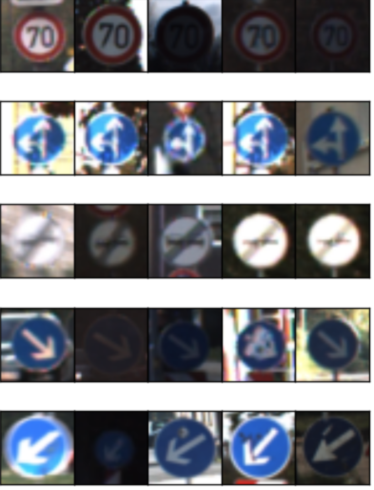
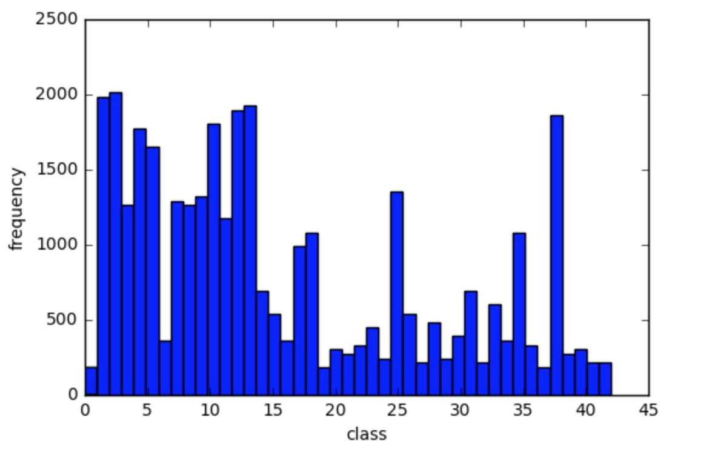
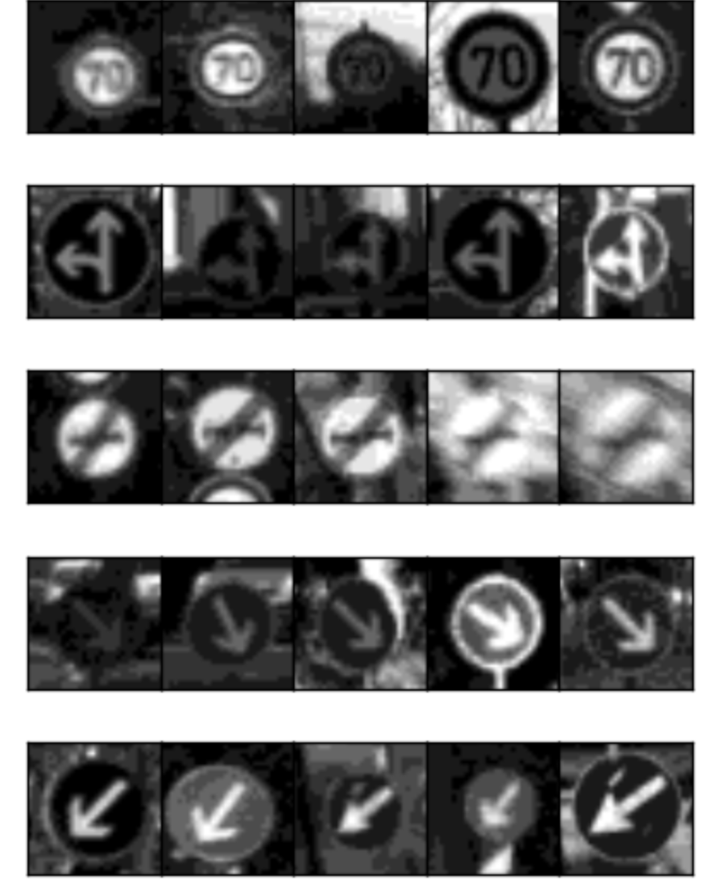
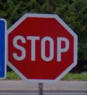

# **Traffic Sign Recognition** 

---

**Traffic Sign Recognition Project**

### The goals / steps of this project are the following:
* Load the data set 
* Explore, summarize and visualize the data set
* Design, train and test a model architecture
* Use the model to make predictions on new images
* Analyze the softmax probabilities of the new images
* Summarize the results with a written report

[//]: # (Image References)

[image1]: ./examples/visualization.jpg "Visualization"
[image2]: ./examples/grayscale.jpg "Grayscaling"
[image3]: ./examples/random_noise.jpg "Random Noise"
[image4]: ./examples/placeholder.png "Traffic Sign 1"
[image5]: ./examples/placeholder.png "Traffic Sign 2"
[image6]: ./examples/placeholder.png "Traffic Sign 3"
[image7]: ./examples/placeholder.png "Traffic Sign 4"
[image8]: ./examples/placeholder.png "Traffic Sign 5"

## Rubric Points
Link to [rubric points](https://review.udacity.com/#!/rubrics/481/view) 

---

Link to my [project code](https://github.com/chdhatri/CarND-Traffic-Sign-Classifier/blob/master/Traffic_Sign_Classifier.ipynb)

### Data Set Summary & Exploration

##### 1. Provide a basic summary of the data set.
In the code, the analysis was done using python, numpy and/or pandas methods rather than hardcoding results manually.

List of classes are provided in the csv file [signnames](./signnames.csv)

* Download dataset: [traffic-signs-data.zip](https://d17h27t6h515a5.cloudfront.net/topher/2017/February/5898cd6f_traffic-signs-data/traffic-signs-data.zip)
* The size of training set is 34799
* The size of the validation set is 4410
* The size of test set is 12630
* The shape of a traffic sign image is (32, 32, 3)
* The number of unique classes/labels in the data set is 43

##### 2. Include an exploratory visualization of the dataset.
Preview of train images

Exploratory visualization of the data set was done using the histogram showing how the data was distributed. Each bar frequencies of the samples in each class/traffic sign.
The distribution of the data doesn't seemed to be normal which can be a problem, but for this project I am not trying to solve this problem.

### Design and Test a Model Architecture

##### 1. Describe how you preprocessed the image data. What techniques were chosen and why did you choose these techniques? 
* Grey Scale : Images of the training dataset have 3 color channels(R, G, B). The Images got converted to Grey Scale to reduce the images to one channel. This was done because it will reduce the amount of input data and will train the model significantly faster. 

* Normalize :  Images got normalized before training for numerical optimization. We always want data to be centered at zero and have equal variance.
This will help to reduce the chance of getting stuck in local optima and reach the required soluiton.

Here is an example of traffic sign images after preprocessing.

##### 2. Describe what your final model architecture looks like including model type, layers, layer sizes, connectivity, etc.) Consider including a diagram and/or table describing the final model.

My final model consisted of the following layers:

| Layer         		|     Description	        					| 
|:---------------------:|:---------------------------------------------:| 
| Input         		| 32x32x1 Grey scale image   					| 
| Convolution 5x5     	| 1x1 stride, valid padding, outputs 28x28x48 	|
| RELU					|												|
| Max pooling	      	| 2x2 stride,  outputs 14x14x48				    |
| Convolution 5x5	    | 1x1 stride, valid padding. outputs 10x10x96   |  									
| RELU                  |     											|
| Max pooling	      	| 2x2 stride,  outputs 5x5x96					|
| Convolution 3x3 		| 1x1 stride, valid padding	3x3x172				|
| RELU                  | 												|
| Max pooling			| 1x1 stride, output 2x2x172					|							
| Flatten				| 688        								    |
| Fully Connected		| 84      									    |
| Fully Connected		| 43											|

##### 3. Describe how you trained your model. The discussion can include the type of optimizer, the batch size, number of epochs and any hyperparameters such as learning rate.

* To train the model, I used an aws GPU instance for trainning the model.  [Followed Udacity Instructions](https://classroom.udacity.com/nanodegrees/nd013/parts/fbf77062-5703-404e-b60c-95b78b2f3f9e/modules/6df7ae49-c61c-4bb2-a23e-6527e69209ec/lessons/614d4728-0fad-4c9d-a6c3-23227aef8f66/concepts/f6fccba8-0009-4d05-9356-fae428b6efb4)

* As mentioned in LeNet5 used Adam Optimizer to minimize the loss funciton.And its a good default choice for the optimzer.

* For Other hyperparameters I am using mean (mu) = 0 , to center the data at origin and a constant standard deviation of 

##### 4. Describe the approach taken for finding a solution and getting the validation set accuracy to be at least 0.93. Include in the discussion the results on the training, validation and test sets and where in the code these were calculated. Your approach may have been an iterative process, in which case, outline the steps you took to get to the final solution and why you chose those steps. Perhaps your solution involved an already well known implementation or architecture. In this case, discuss why you think the architecture is suitable for the current problem.

Final training parameters:
* EPOCHS = 35
* BATCH_SIZE = 128
* SIGMA = 0.1
* OPIMIZER: AdamOptimizer (learning rate = 0.001)

Final model results were:
* validation set accuracy of **95.9%**
* test set accuracy of **94.6%**

##### 5. Approach
Model training was based on LeNet-5 shown in the udacity classroom. 
I modified the train and validation images to work with the input shape of 32x32x1 by converting them to grey scale. 
Training for more than 35 epochs do not increase the validation accuracy. I trained the network for 50 and more epochs, but I get a slightly decreasing accuracy. So I decided to stop training after 35 epochs.

### Test a Model on New Images

#### 1. Choose five German traffic signs found on the web and provide them in the report. For each image, discuss what quality or qualities might be difficult to classify.

Here are five German traffic signs that I found on the web:

#### 2. Discuss the model's predictions on these new traffic signs and compare the results to predicting on the test set. At a minimum, discuss what the predictions were, the accuracy on these new predictions, and compare the accuracy to the accuracy on the test set (OPTIONAL: Discuss the results in more detail as described in the "Stand Out Suggestions" part of the rubric).

Here are the results of the prediction:

| Image			        |     Prediction	        					| 
|:---------------------:|:---------------------------------------------:| 
| Stop Sign      		| Stop sign   									| 
| No Entry     			| No Entry										|
| Yield					| Yield											|
| 30 km/h	      		| 30 km/h					 				|
| Keep Right			| Keep Right      							|

For my test images the model predicted correctly all the signs , which gives an accuracy of 100% for these test images. But it may not be same for all conditions. If time permits I would like to  like to try with different test images and compare the results to the accuracy on multiple test set.
